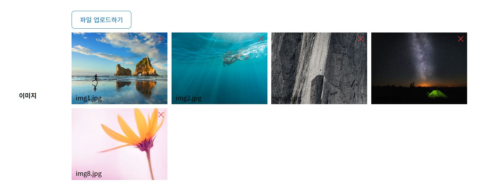

# 썸네일이 있는 multiful file upload

```html
<div class="fileWrap">
    <label for="file">
        <div class="upload">파일 업로드하기</div>
    </label>
    <input type="file" name="img" id="thumbFile" class="imgFileUpload" accept='image/*' multiple>
</div>
<div id="thumbWrap">
</div>
```

```css
#thumbWrap {
    display: flex;
    flex-wrap: wrap;
    gap: 1rem;
    width: 100%;
    height: fit-content;
}
#thumbWrap .thumb {
    width: 24rem;
    height: 18rem;
    overflow: hidden;
}
#thumbWrap .thumb .imgWrap {
    position: relative;
    width: 100%;
    height: 100%;
}
#thumbWrap .thumb .imgWrap img {
    width: 100%;
    height: 100%;
    object-fit: cover;
}
#thumbWrap .thumb .imgWrap .imageName {
    position: absolute;
    bottom: 0.5rem;
    left: 1rem;
}
#thumbWrap .thumb .imgWrap .xBtn {
    position: absolute;
    top: 0;
    right: 0;
    width: 3.2rem;
    height: 3.2rem;
    background: url(x버튼 이미지 url을 넣어주세요.) center / contain no-repeat;
    cursor: pointer;
}
.fileWrap {
    position: relative;
    margin-bottom: 1rem;
}
.fileWrap .upload,
.fileWrap .imgFileUpload {
    width: fit-content;
    padding: 1rem 2rem;
    border: 0.1rem solid #0078bd;
    border-radius: 0.8rem;
    color: #0078bd;
}
.fileWrap .imgFileUpload {
    position: absolute;
    top: 0;
    left: 0;
    opacity: 0;
}
.fileWrap .imgFileUpload.hide {
    display: none;
}
```

```javascript
window.addEventListener('load', function() {
    function imgUpload(input) {
        const thumbWrap = document.getElementById("thumbWrap");
        console.log(input.files);
        if(input.files) {
            const imgFileArr = Array.from(input.files);

            imgFileArr.forEach((file) => {
                const reader = new FileReader();            
                const $thumb = document.createElement("div");
                $thumb.classList.add("thumb");
                // imgWrap
                const $imgDiv = document.createElement("div"); 
                $imgDiv.classList.add("imgWrap");
                // 이미지
                const $img = document.createElement("img");
                $img.classList.add("image");
                // file 이름
                const $label = document.createElement("label");
                $label.classList.add("imageName");
                // x버튼
                const $remove = document.createElement("div");
                $remove.classList.add("xBtn");

                $label.textContent = file.name;
                $thumb.appendChild($imgDiv);
                $imgDiv.appendChild($img);
                $imgDiv.appendChild($label);
                $imgDiv.appendChild($remove);

                reader.onload = e => {
                    $img.src = e.target.result;
                }
                
                reader.readAsDataURL(file);
                thumbWrap.appendChild($thumb);
            })

        }
    }
    
    document.addEventListener('click', function(e) {
        if(e.target && e.target.className === 'imgFileUpload') {
            const thumbFiles = document.querySelectorAll(".imgFileUpload");
            thumbFiles.forEach(function(thumbFile) {
                thumbFile.addEventListener("change", e => {
                    imgUpload(e.target);
                    // file 추가
                    e.target.classList.add('hide');
                    const $inputFile = document.createElement("input"); 
                    $inputFile.type = "file";
                    $inputFile.classList.add('imgFileUpload');
                    $inputFile.setAttribute("name","img");
                    $inputFile.setAttribute("accept","image/*");
                    $inputFile.setAttribute("multiple","");
                    document.querySelector('.fileWrap').appendChild($inputFile);
                });
            });
        }
    });
    
    // 이미지 삭제
    let  = document.querySelectorAll("#thumbWrap .thumb .xBtn");
    document.addEventListener('click',function(e){
        if(e.target && e.target.className == 'xBtn'){
            e.target.closest(".thumb").remove();
        }
    }); 

});
```


참고링크 : http://yoonbumtae.com/?p=3304
